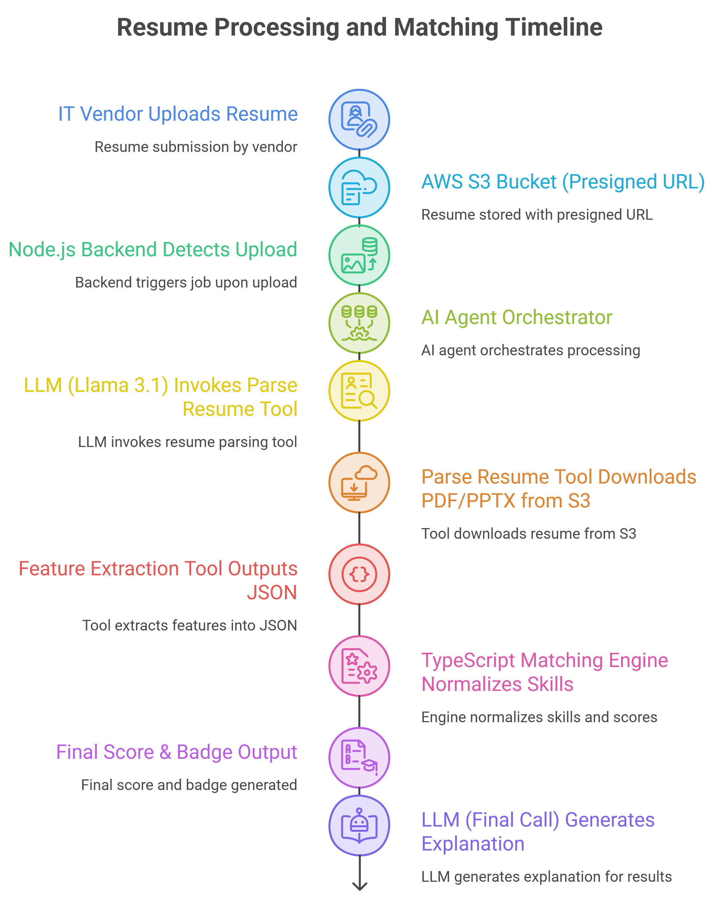
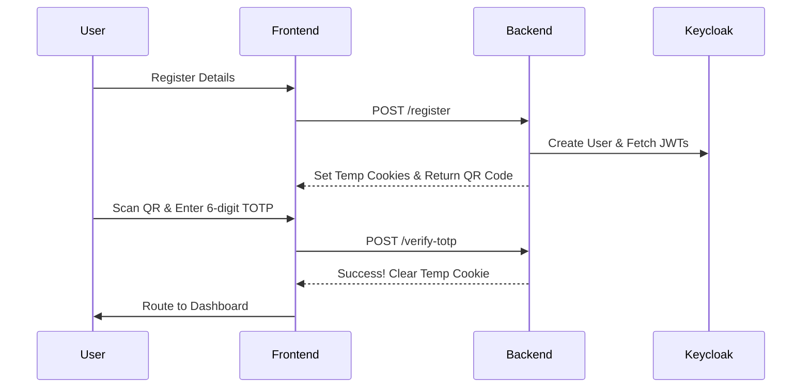
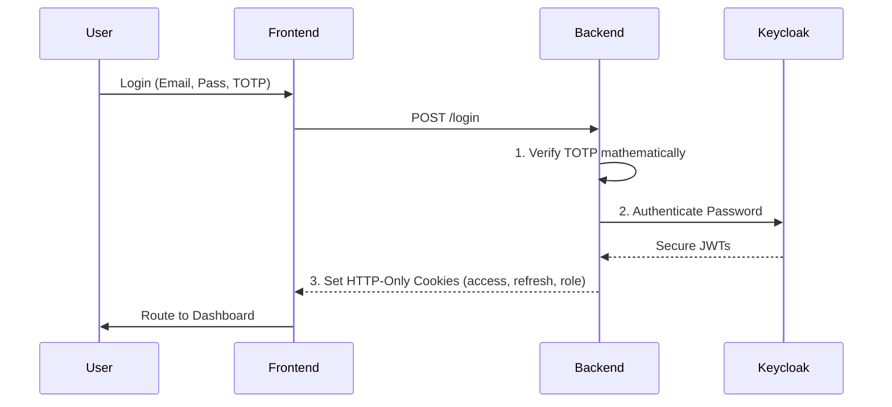

# Zelosify — Vendor & Hiring Manager Contract Management Module


A full-stack, multi-tenant recruitment platform that streamlines vendor candidate submission, AI-powered resume evaluation, and hiring manager decision workflows — all within a secure, role-based architecture.

---

## Table of Contents

1. [Problem Statement / Objective](#problem-statement--objective)
2. [Features](#features)
3. [Tech Stack](#tech-stack)
4. [System Architecture / Workflow](#system-architecture--workflow)
5. [Installation & Setup](#installation--setup)
6. [Usage](#usage)
7. [API Integration](#api-integration)
8. [Folder Structure](#folder-structure)
9. [Contributing](#contributing)
10. [License](#license)
11. [Author / Contact](#author--contact)

---

## Problem Statement / Objective

Enterprise recruitment processes frequently suffer from fragmented tooling: vendors submit candidate CVs through email or disconnected portals, hiring managers evaluate profiles manually, and no centralised audit trail exists. This results in slow time-to-hire, inconsistent candidate assessment, and poor visibility across procurement teams.

Furthermore, implementing AI into recruitment often results in fragile "LLM Wrappers" that hallucinate scores and cannot be mathematically audited.

**Zelosify** solves this by providing a unified, multi-tenant SaaS platform where:
- IT vendors securely submit candidate profiles (native PDF and PPTX resumes) against open job requirements via pre-signed S3 URLs.
- A **3-Phase Agentic AI Pipeline** orchestrates LLM text extraction and maps it to a **Deterministic Scoring Engine**, ensuring candidate ranking is 100% hallucination-free and mathematically auditable.
- Hiring managers review transparent, AI-generated reasoning, shortlist or reject profiles, and track the full hiring lifecycle.
- All actions are gated by fine-grained role-based access control (RBAC) with Keycloak SSO.

---

## Features

### Vendor Portal
- Browse and filter active job openings scoped to the vendor's tenant.
- Secure, scalable resume upload via direct-to-S3 Pre-signed URLs (bypassing backend bottlenecks).
- Pre-submission profile management (soft-delete uploads).
- Time-limited S3 pre-signed URLs for resume preview and validation.

### AI-Powered Recommendation Engine
- Autonomous **Agentic Pipeline** orchestrated dynamically without hardcoded sequences:
  - **Tool A (Extraction):** Dynamic native parsing of PDF/PPTX without third-party parser dependencies.
  - **Tool B (Scoring):** A strictly deterministic TypeScript math engine that scores candidates purely on overlapping required skills arrays mapped exactly to job types.
  - **Tool C (Reasoning):** LLM synthesis of the mathematical score to generate human-readable justifications.
- Backed by **Groq (Llama 3.1)** for incredibly fast, low-latency inference.
- Advanced observability logging tokens used, extraction latency, and reasoning confidence into the DB.

### Hiring Manager Dashboard
- View all openings assigned to the hiring manager.
- Per-opening candidate list with AI recommendation scores, matched/missing skills, and transparent reasoning.
- One-click shortlist or reject actions with full audit timestamps.
- Native resume viewer utilizing pre-signed S3 URLs.

### Security & Identity
- **Keycloak** OpenID Connect SSO with session management.
- JWT verification and refresh token rotation.
- Custom TOTP-based two-factor authentication loop (`otplib` + QR code generation) during signup.
- Role-based route guards enforced on server (Express middleware) and client (Next.js middleware).

### Multi-Tenancy
- All data (openings, profiles, users) is rigidly scoped to a `tenantId`.
- Tenant isolation enforced strictly at the database query level via Prisma middleware.

---

## Tech Stack

| Layer | Technology | Purpose |
|---|---|---|
| **Frontend** | Next.js 15, React 19 | App shell, SSR/CSR, routing |
| **UI Library** | Tailwind CSS 3, shadcn/ui (Radix UI) | Component primitives and styling |
| **State Management** | Redux Toolkit 2, React Redux | Global client state |
| **Backend** | Node.js 22, Express 4, TypeScript 5 | REST API and Agent Orchestrator |
| **ORM** | Prisma 6 | Type-safe PostgreSQL access |
| **Database** | PostgreSQL 15 | Relational data store |
| **Authentication** | Keycloak 26, JWT, TOTP | SSO, session, 2FA |
| **File Storage** | AWS S3, `@aws-sdk/client-s3` | Resume storage and pre-signed URLs |
| **AI / Inference** | Groq (Llama 3.1) | Low-latency tool-calling agent |
| **Containerisation** | Docker Compose | Local PostgreSQL + Keycloak services |
| **Testing** | Vitest | Unit tests for deterministic logic |

---

## System Architecture / Workflow

### AI Recommendation Engine Architecture


### Secure User Onboarding & Auth Flow

#### 1. Registration & 2FA Flow


#### 2. Login Flow


### End-to-end hiring workflow:
1. **IT Vendor** browses open roles, uploads candidate PDFs/PPTXs to S3 via Pre-signed URLs.
2. **Backend** queues AI recommendation jobs based on S3 object keys.
3. **Recommendation Engine** dynamically parses resumes natively, evaluates via deterministic math, and persists reasoning.
4. **Hiring Manager** reviews mathematically scored candidates, shortlists or rejects.


---

## Installation & Setup

### Prerequisites

| Requirement | Version |
|---|---|
| Node.js | ≥ 22 |
| npm | ≥ 9 |
| Docker & Docker Compose | Latest stable |
| PostgreSQL | 15 (via Docker) |
| AWS Account | S3 bucket required |
| Keycloak Realm | Pre-configured realm exported |

### 1. Clone the Repository

```bash
git clone https://github.com/AmanSingh-24/Vendor-Hiring-Manager-Contract-Management-Module.git
cd Vendor-Hiring-Manager-Contract-Management-Module
```

### 2. Start Infrastructure Services (PostgreSQL + Keycloak)

```bash
cd Zelosify-Backend/Server
docker compose up -d
```

Wait for both containers to report healthy. Keycloak admin UI is available at `http://localhost:8080/auth`.

### 3. Backend Setup

```bash
cd Zelosify-Backend/Server

# Install dependencies
npm install

# Copy and configure environment variables
cp .env

# Run database migrations
npm run prisma:migrate

# Start development server
npm run dev
```

Backend runs on **http://localhost:5000**.

### 4. Frontend Setup

```bash
cd Zelosify-Frontend

# Install dependencies
npm install

# Start development server
npm run dev
```

Frontend runs on **http://localhost:5173**.

---

## Usage

### Running Tests

```bash
# Backend tests for Deterministic Scoring logic
cd Zelosify-Backend/Server
npm test
```

### Building for Production

```bash
# Backend
cd Zelosify-Backend/Server
npm run build 
npm run prisma:deploy
npm start

# Frontend
cd Zelosify-Frontend
npm run build
npm start
```

### Role-Based Access

| Role | Portal Access |
|---|---|
| `HIRING_MANAGER` | View openings, review/shortlist/reject profiles |
| `IT_VENDOR` | Browse openings, upload candidate profiles |


## API Integration

All API endpoints are versioned under `/api/v1/`. Authentication is enforced via JWT Bearer tokens issued by Keycloak and transmitted via HTTP-Only cookies.

### Authentication

| Method | Endpoint | Description |
|---|---|---|
| `POST` | `/api/v1/auth/login` | Initiate Keycloak login with TOTP |
| `POST` | `/api/v1/auth/logout` | Terminate session and clear cookies |
| `POST` | `/api/v1/auth/totp/setup` | Generate TOTP secret + QR code |
| `POST` | `/api/v1/auth/totp/verify` | Verify TOTP code |

### Hiring Manager

| Method | Endpoint | Auth Role | Description |
|---|---|---|---|
| `GET` | `/api/v1/hiring-manager/openings` | `HIRING_MANAGER` | List assigned openings |
| `GET` | `/api/v1/hiring-manager/openings/:id/profiles` | `HIRING_MANAGER` | Get candidate profiles for an opening |
| `GET` | `/api/v1/hiring-manager/profiles/:id/resume-url` | `HIRING_MANAGER` | Get pre-signed resume download URL |
| `POST` | `/api/v1/hiring-manager/profiles/:id/shortlist` | `HIRING_MANAGER` | Shortlist a candidate profile |
| `POST` | `/api/v1/hiring-manager/profiles/:id/reject` | `HIRING_MANAGER` | Reject a candidate profile |

### Vendor

| Method | Endpoint | Auth Role | Description |
|---|---|---|---|
| `GET` | `/api/v1/vendor/openings` | `IT_VENDOR` | List available job openings |
| `GET` | `/api/v1/vendor/openings/:id` | `IT_VENDOR` | Get opening details |
| `POST` | `/api/v1/vendor/openings/:id/profiles/presign` | `IT_VENDOR` | Generate Pre-Signed S3 upload URL |

---

## Folder Structure

```text
Vendor-Hiring-Manager-Contract-Management-Module/
├── Zelosify-Backend/
│   └── Server/
│       ├── .env
│       ├── .gitignore
│       ├── docker-compose.yml
│       ├── nodemon.json
│       ├── package-lock.json
│       ├── package.json
│       ├── tsconfig.json
│       ├── vitest.config.ts
│       ├── prisma/
│       │   ├── schema.prisma
│       │   └── migrations/
│       ├── src/
│       │   ├── index.ts
│       │   ├── config/
│       │   │   ├── keycloak/
│       │   │   │   └── index.ts
│       │   │   └── multer/
│       │   │       └── index.ts
│       │   ├── controllers/
│       │   │   ├── auth/
│       │   │   │   ├── local/
│       │   │   │   │   ├── localAuthController.ts
│       │   │   │   │   ├── localLogin.ts
│       │   │   │   │   └── localRegister.ts
│       │   │   │   └── oidc/
│       │   │   │       └── oidcController.ts
│       │   │   ├── hiring/
│       │   │   │   └── index.ts
│       │   │   ├── vendor/
│       │   │   │   └── index.ts
│       │   │   └── controllers.ts
│       │   ├── middlewares/
│       │   │   └── auth/
│       │   │       └── index.ts
│       │   ├── routers/
│       │   │   ├── auth/
│       │   │   │   └── index.ts
│       │   │   ├── aws/
│       │   │   │   └── index.ts
│       │   │   ├── hiring/
│       │   │   │   └── index.ts
│       │   │   ├── public/
│       │   │   │   └── index.ts
│       │   │   └── vendor/
│       │   │       └── index.ts
│       │   ├── services/
│       │   │   ├── ai/
│       │   │   │   ├── agent.ts
│       │   │   │   ├── orchestrator.ts
│       │   │   │   └── tools/
│       │   │   │       ├── matchingEngine.test.ts
│       │   │   │       ├── matchingEngine.ts
│       │   │   │       └── tools.ts
│       │   │   ├── storage/
│       │   │   │   └── awsS3Service.ts
│       │   │   └── vendorService.ts
│       │   ├── helpers/
│       │   │   └── index.ts
│       │   ├── models/
│       │   │   └── index.ts
│       │   ├── scripts/
│       │   │   └── setup.ts
│       │   ├── types/
│       │   │   └── index.ts
│       │   └── utils/
│       │       └── index.ts
│       └── tests/
│           └── integration/
│               └── rbac-tenant.unit.test.ts
│
└── Zelosify-Frontend/
    ├── package.json
    ├── next.config.mjs
    ├── postcss.config.mjs
    ├── tailwind.config.mjs
    ├── jsconfig.json
    ├── .eslintrc.json
    ├── .gitignore
    ├── middleware.js
    ├── components.json
    ├── public/
    │   ├── favicon.ico
    │   └── assets/
    │       └── images/
    │           └── architecture.png
    └── src/
        ├── app/
        │   ├── layout.jsx
        │   ├── page.jsx
        │   ├── (Landing)/
        │   │   └── layout.jsx
        │   └── (UserDashBoard)/
        │       ├── layout.jsx
        │       ├── hiring-manager/
        │       │   └── page.jsx
        │       ├── vendor/
        │       │   └── page.jsx
        │       ├── business-user/
        │       │   └── page.jsx
        │       └── user/
        │           └── page.jsx
        ├── components/
        │   ├── UI/
        │   │   └── shadcn/
        │   │       ├── button.jsx
        │   │       ├── card.jsx
        │   │       ├── input.jsx
        │   │       ├── label.jsx
        │   │       ├── select.jsx
        │   │       ├── table.jsx
        │   │       └── toast.jsx
        │   └── UserDashboardPage/
        │       ├── Header/
        │       │   └── Header.jsx
        │       └── SideBar/
        │           └── SideBar.jsx
        ├── contexts/
        │   └── AuthContext.jsx
        ├── hooks/
        │   ├── Auth/
        │   │   └── useAuth.js
        │   └── UI/
        │       └── useMobile.js
        ├── lib/
        │   └── utils.js
        ├── pages/
        │   └── LandingPage/
        │       ├── LandingPage.jsx
        │       └── auth/
        │           ├── LoginPage.jsx
        │           ├── RegisterPage.jsx
        │           └── SetupTOTP.jsx
        ├── redux/
        │   ├── core/
        │   │   ├── store.js
        │   │   └── AllProvider.jsx
        │   └── features/
        │       └── Auth/
        │           └── authSlice.js
        ├── services/
        │   └── api.js
        ├── styles/
        │   └── globals.css
        └── utils/
            ├── Auth/
            │   └── roleUtils.js
            ├── Axios/
            │   └── AxiosInstance.js
            └── Common/
                └── fileUploadValidation.js
```


 Contact

**AmanSingh/24**
- GitHub: [@AmanSingh-24](https://github.com/AmanSingh-24)

*Built as a production-oriented prototype demonstrating full-stack engineering, AI-augmented workflows, multi-tenant SaaS architecture, and enterprise-grade identity management.*
