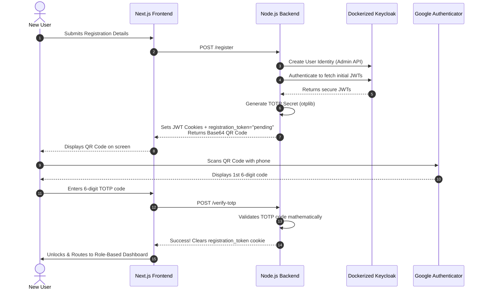
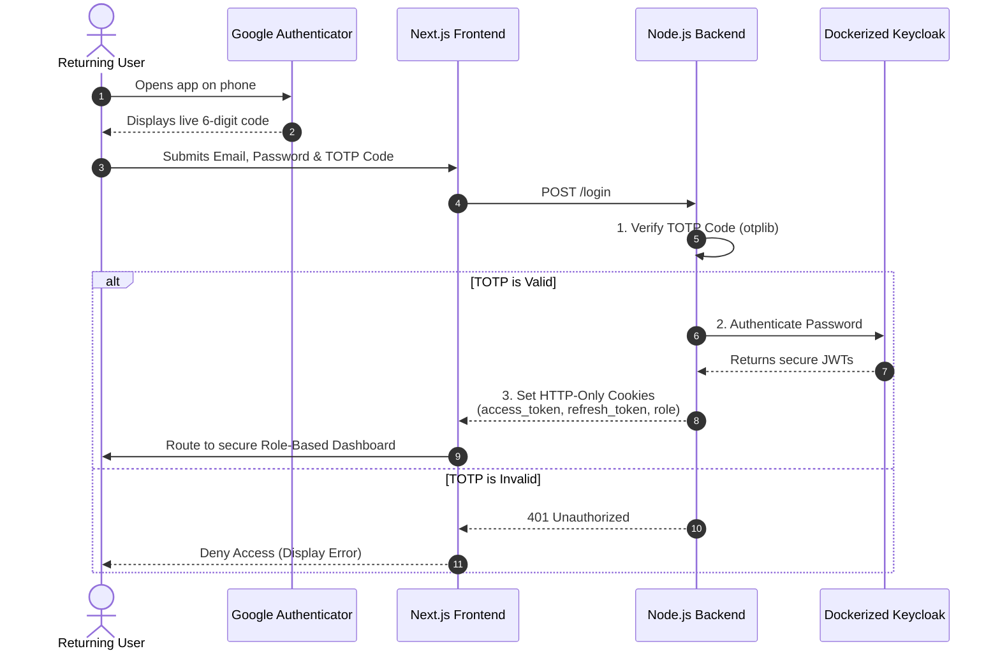

# Zelosify Recruit — Enterprise AI Hiring Platform


A production-grade, multi-tenant recruitment platform that streamlines vendor candidate submission, deterministic AI-powered resume evaluation, and hiring manager decision workflows — all secured by strict Role-Based Access Control (RBAC) and Keycloak IAM.

---

## 📖 Table of Contents

1. [Problem Statement & Objective](#problem-statement--objective)
2. [System Architecture](#system-architecture)
   - [AI Recommendation Orchestrator](#1-3-phase-ai-recommendation-orchestrator)
   - [Secure User Onboarding & 2FA Flow](#2-secure-user-onboarding--2fa-flow)
3. [Key Features](#key-features)
4. [Tech Stack](#tech-stack)
5. [Getting Started (Quick Setup)](#getting-started-quick-setup)
6. [Repository Structure](#repository-structure)

---

## 🎯 Problem Statement & Objective

Enterprise recruitment workflows are often fragmented. Vendors submit CVs via email, hiring managers manually grade them, and no centralized audit trail exists. Worse, implementing AI often results in "LLM Wrappers" that hallucinate scores and cannot be mathematically audited.

**Zelosify Recruit** solves this by providing a unified SaaS platform where:
- **IT Vendors** securely submit PDF/PPTX resumes via pre-signed S3 URLs.
- A **3-Phase Agentic AI Pipeline** parses resumes and mathematically scores them using a **Deterministic Matching Engine** (zero hallucination).
- **Hiring Managers** review the transparent, AI-generated reasoning and shortlist candidates.
- Everything is heavily gated by **Tenant-Isolation** and **Keycloak 2FA**.

---

## 🏗️ System Architecture

### 1. 3-Phase AI Recommendation Orchestrator
Our AI system is not a simple LLM wrapper. It uses a strict tool-calling loop where the LLM is only used for text extraction and reasoning, while the actual scoring is done by a mathematically deterministic TypeScript engine.


### 2. Secure User Onboarding & 2FA Flow
Our authentication flow is backed by a Dockerized Keycloak server, utilizing TOTP generation (`otplib`) and strictly HTTP-Only secure cookies to prevent XSS attacks.

#### Registration Flow


#### Login Flow


---

## ✨ Key Features

- **Strict Multi-Tenancy:** Prisma middleware and API route guards ensure data is 100% isolated by `tenantId`.
- **Dynamic Tool-Calling Agent:** Groq (Llama 3.1) autonomously orchestrates native PDF and PPTX parsing tools without external third-party parsing dependencies.
- **Deterministic Math Engine:** The LLM does NOT calculate the score. All matching is handled deterministically by a hardcoded TypeScript engine, preventing hallucinations.
- **Enterprise IAM:** Full integration with Keycloak (Dockerized), TOTP Authenticator apps, and strict HTTP-Only cookie management.
- **High Observability:** Structured JSON logging captures LLM token usage, latency (ms), and persistence of reasoning metadata inside PostgreSQL.

---

## 🛠️ Tech Stack

| Layer | Technology | Purpose |
|---|---|---|
| **Frontend** | Next.js 15, React 19, Tailwind CSS | UI, SSR/CSR, and styling |
| **Backend** | Node.js 22, Express, TypeScript 5 | REST API and Agent Orchestration |
| **Database & ORM** | PostgreSQL 15, Prisma | Multi-tenant relational data store |
| **Identity & Security** | Keycloak, JWT, `otplib` | OIDC SSO, session management, 2FA |
| **Storage** | AWS S3 (Pre-signed URLs) | Secure, backend-bypassed resume uploads |
| **AI / Inference** | Groq (Llama 3.1) | Low-latency tool-calling agent |

---

## 🚀 Getting Started (Quick Setup)

1. **Boot Infrastructure:**
   ```bash
   cd Zelosify-Backend/Server
   docker-compose up -d
   ```
2. **Start the Backend:**
   ```bash
   npm install
   npm run prisma:migrate
   npm run dev
   ```
3. **Start the Frontend:**
   ```bash
   cd ../../Zelosify-Frontend
   npm install
   npm run dev
   ```

*(For detailed setup and API documentation, please refer to the specific READMEs inside the Frontend and Backend folders).*

---

## 📂 Repository Structure

- `Zelosify-Backend/` - Contains the Express.js server, Prisma schemas, and the 3-Phase AI Orchestrator.
- `Zelosify-Frontend/` - Contains the Next.js application, React components, and Role-Based Dashboards.
